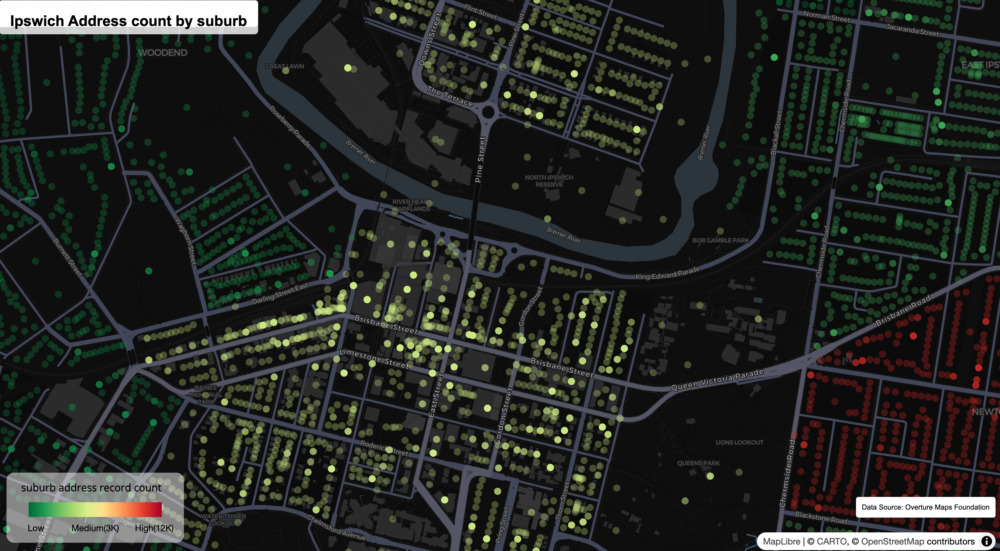

# 30DayMapChallenge2025
Placeholder for 30DayMapChallenge on 2025

# Catalog
| Day   | Brief    | Tool | Data Source |Map |
| :----:| :------: | :---:|:---:|:-----------------------------------------|
| [Day 1](https://wilsonyungsh.github.io/interactive/30DayMapChallenge2025/map1_ipswich_address_map.html) | Points   | R + duckdb + mapgl|OvertureMap||
| Day 2 | Lines    | R + ggplot2|| |
| [Day 3](https://wilsonyungsh.github.io/interactive/30DayMapChallenge2025/map3_address_density_map.html) | Polygons | R + duckdb + mapgl|OvertureMap| |